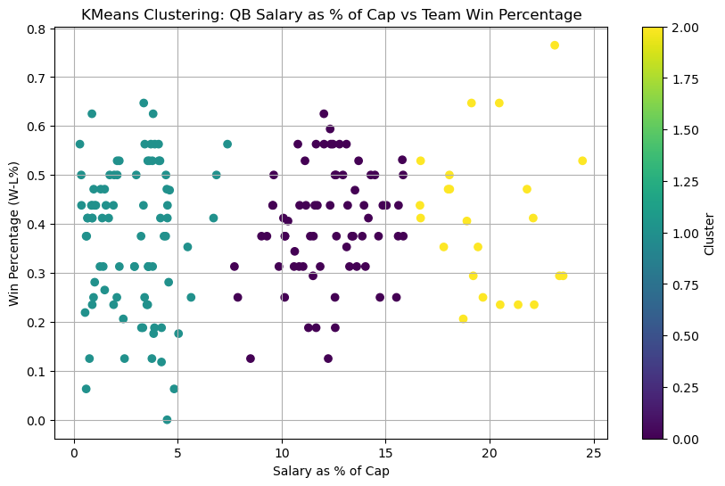

# Quarterback Salary Analysis

Exploratory analysis examining how NFL quarterback salaries relate to team success.  
The dataset, collected and cleaned manually from multiple public sources, explores patterns between annual salary, salary as a percentage of the team cap, and win percentage.



## Goal
To investigate whether higher quarterback pay correlates with better team performance and to identify possible tiers or clusters in salary-to-performance relationships.

## Built With
- Python  
- pandas, matplotlib, seaborn  
- scikit-learn (K-Means clustering)

## Features
- Salary vs. win percentage scatter plots (absolute and cap-adjusted)  
- K-Means clustering to identify QB salary tiers  
- Analysis of win-percentage variability across salary groups  

## Files
```
qb_salary_analysis/
├── qb_salary_analysis.ipynb   # Jupyter notebook for QB salary and win analysis  
├── qb_salary_clusters.png     # KMeans clustering visualization  
├── qb_salaries.csv            # QB salary data 
├── NFL_Salary_Cap.csv         # Annual NFL salary cap data  
├── Team WL 10 years.csv       # Team win-loss records (10-year span) data
└── README.md                  # Project overview and documentation 
```

## Data Source
Self-compiled dataset using publicly available NFL salary and team performance data from overthecap.com and sportrac.com.

